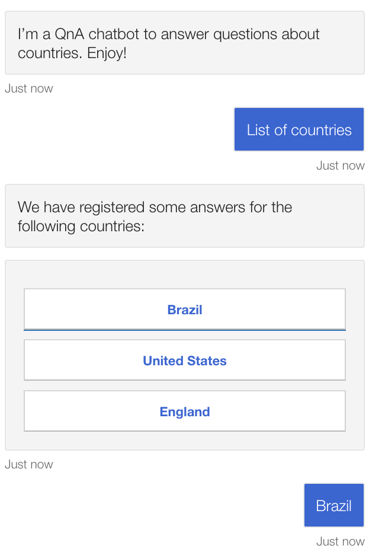

# ChatBot-Skills
The goal of this repository is to implement a chatbot with a skill using Microsoft's framework. The skill is a chatbot with different responsabilities. 

## Countries FAQ

The ideia of this skill is to implement QnA azure service to answer simple questions about countries. 
Examples of questions:

- What is the size of Brazil?
- How many official languages does India have?
- How many people live in United States?
etc...

- I have cloned microsoft repository repository about qna multiturn --> https://github.com/microsoft/BotBuilder-Samples/tree/master/samples/csharp_dotnetcore/70.qnamaker-multiturn-sample

As we can in the image below, if we write "countries" or something similar, the chatbot display an adaptive card showing other options.

</img>

Then we can click in another option to continue the chat. 

</img>

  

</img>

Another cool function of this chatbot is capability to recognize written language and not only buttons. Therefore, I can type the name of a country in the middle of the conversation and the chatbot will give me the information about this country.

</img>

As we can see this is a demostration 
of a multiturn chat with information about countries. 

I have implemented more informations about countries. But I guess all thoses images are enough to understand the concept of QnA multiturn.

## Linking the Countries QnA with a skill in a main chatbot

Following these tutorials from Microsoft we can implement a central chatbot with several other skills.

- https://docs.microsoft.com/en-us/azure/bot-service/skill-implement-skill?view=azure-bot-service-4.0&tabs=cs
- https://docs.microsoft.com/en-us/azure/bot-service/skill-implement-consumer?view=azure-bot-service-4.0&tabs=cs

The first image is the SimpleRootBot. By writing "list of countries" this central bot invokes the Countries QnA skill. 
