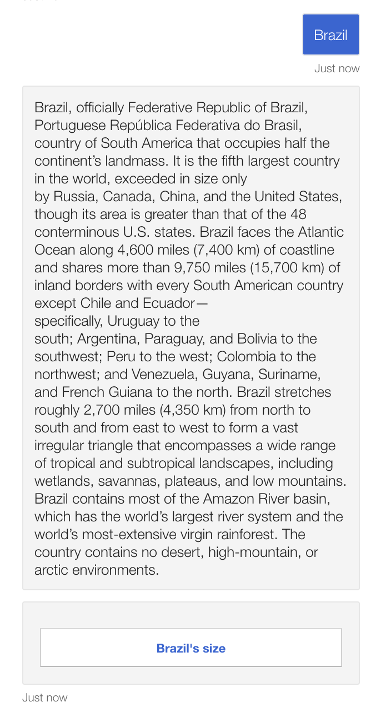
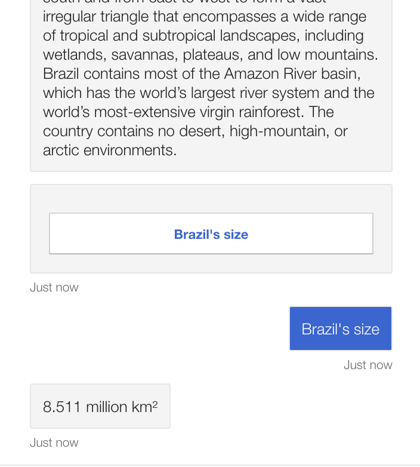
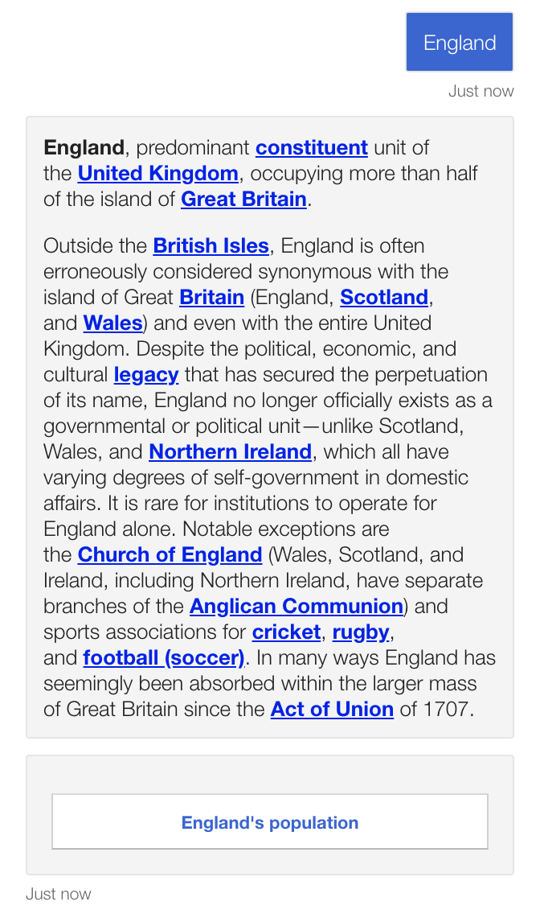

# ChatBot-Skills
The goal of this repository is to implement several skills, each one with different objectives. 

## Countries FAQ

The ideia of this skill is to implement QnA azure service to answer simple questions about countries. 
Examples of questions:

- What is the size of Brazil?
- How many official languages does India have?
- How many people live in United States?
etc...

1) I have cloned microsoft repository repository about qna multiturn --> https://github.com/microsoft/BotBuilder-Samples/tree/master/samples/csharp_dotnetcore/70.qnamaker-multiturn-sample

- As we can in the image below, if we write "countries" or something similar, the chatbot display an adaptive card showing other options.

- Then we can click in another option to continue the chat. 

  

- Another cool function of this chatbot is capability to recognize written language and not only buttons. Therefore I can type the name of a country in the middle of the conversation and the chatbot will give me the information about this country.

As we can see this is a demostration 
of a multiturn chat with information about countries. 

## Linking the Countries FAQ with a skill in a main chatbot